# EvalKit User Guide

**Model Error Detective** (EvalKit) is an open-source toolkit for analyzing and visualizing meteorological model outputs. It provides three complementary tools to help researchers and forecasters explore, compare, and diagnose model errors:

| Tool | Purpose | Notebook |
|---|---|---|
| 🗺️ **Dynamic Maps** | Spatial visualization of surface variables (dynamic, static, and multi-step maps) | [dynamic_maps/notebooks/dynamic_map.ipynb](dynamic_maps/notebooks/dynamic_map.ipynb) |
| ⏱️ **Clickable Timeseries** | Interactive point-and-click time-series comparison across models and observations | [clickable_timeseries/notebooks/timeseries_analysis.ipynb](clickable_timeseries/notebooks/timeseries_analysis.ipynb) |
| 📊 **Probabilistic Forecast Tool** | Ensemble forecast visualization: meteograms, plumes, stamps, and CDFs | [probabilistic_forecast_tool/notebooks/probabilistic_forecast_tool.ipynb](probabilistic_forecast_tool/notebooks/probabilistic_forecast_tool.ipynb) |

This guide consolidates the usage instructions from all three notebooks into a single reference, along with setup and customization information. For a quick description of each tool, see the [README](README.md).

## Table of Contents

1. [Getting Started](#getting-started)
2. [Dynamic Maps](#-dynamic-maps)
3. [Clickable Timeseries](#-clickable-timeseries)
4. [Probabilistic Forecast Tool](#-probabilistic-forecast-tool)
5. [Customization and Extensibility](#customization-and-extensibility)
6. [Tips for Best Results](#tips-for-best-results)
7. [Getting Help / Contributing](#getting-help--contributing)

---

## Getting Started

Full environment setup steps (WSL, Poetry, dependencies) are documented in [GETTING_STARTED.md](GETTING_STARTED.md). In short:

1. Clone the repository and install dependencies with Poetry (`poetry install --with dev,jupyter`) — see [CONTRIBUTING.md](CONTRIBUTING.md) for the full contributor workflow.
2. Activate the environment: `eval $(poetry env activate)`.
3. Launch Jupyter and open the notebook for the tool you want to use:
   - [clickable_timeseries/notebooks/timeseries_analysis.ipynb](clickable_timeseries/notebooks/timeseries_analysis.ipynb)
   - [dynamic_maps/notebooks/dynamic_map.ipynb](dynamic_maps/notebooks/dynamic_map.ipynb)
   - [probabilistic_forecast_tool/notebooks/probabilistic_forecast_tool.ipynb](probabilistic_forecast_tool/notebooks/probabilistic_forecast_tool.ipynb)
4. Run the cells in order. The last cell in each notebook launches the interactive interface described below.

---

## 🗺️ Dynamic Maps

**EvalKit — Interactive Surface Variables Visualization Tool**

### Overview

A comprehensive interface for downloading, processing, and visualizing surface weather variables with integrated mapping. The application consists of three main collapsible panels:

1. **Configuration Panel** — set up data sources and analysis parameters
2. **Surface Variables Calculator** — compute derived meteorological variables
3. **Interactive Plotting** — create and customize visualizations

### Step 1: Configure Your Data Source

The Configuration Panel offers two data source options.

**Option A: Download from MARS Archive**

1. Select the **"Download from MARS Archive"** radio button.
2. **Parameter Selection**: select meteorological parameters from the scrollable list (e.g. 2m Temperature, Wind components, Precipitation). Multiple parameters can be selected.
3. **Model & Time Settings**: choose a **Model** (e.g. IFS Operational), enter a **Date** (`YYYY-MM-DD`, e.g. `2026-03-29`), and pick a **Time** (e.g. `00:00:00`).
4. **Forecast Steps**: enter a **Start Step** and **End Step** (hours), click **"Update Steps"**, then use **"Select All Steps"** / **"Deselect All"** as needed. Review the generated steps in the scrollable list.
5. **Geographic Area**: enter **North**/**South**/**West**/**East** coordinates, or draw a rectangle directly on the interactive map — the coordinate boxes populate automatically.
6. **Grid Resolution**: enter a value (e.g. `0.25`) for a regular grid, or leave empty to use the native reduced Gaussian grid. Use **"Reset Grid"** / **"Clear Grid"** as needed.
7. **Action Buttons**: **Preview Settings** to review before downloading, **Retrieve Data** to start the download, **Reset All** to clear everything.

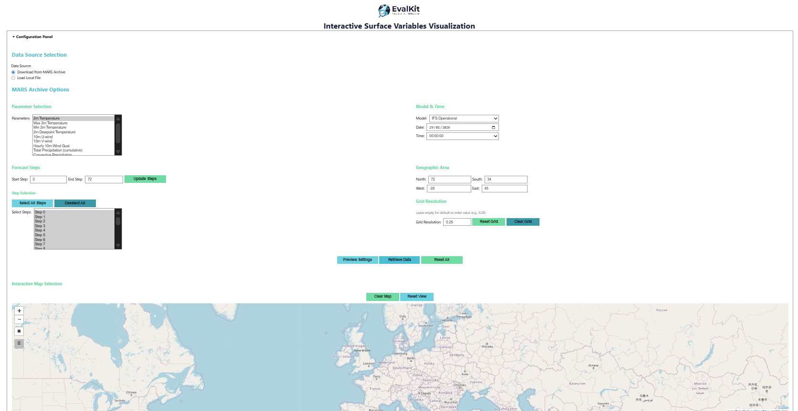

**Option B: Load Local File**

1. Select **"Load Local File"**.
2. Enter a file path directly (e.g. `path/to/yourdata.grib`) or click **"Browse Files"**, then click **"Load File"**.
3. Use the interactive map (zoom controls, drawing tool) to inspect the geographic coverage of the loaded file.

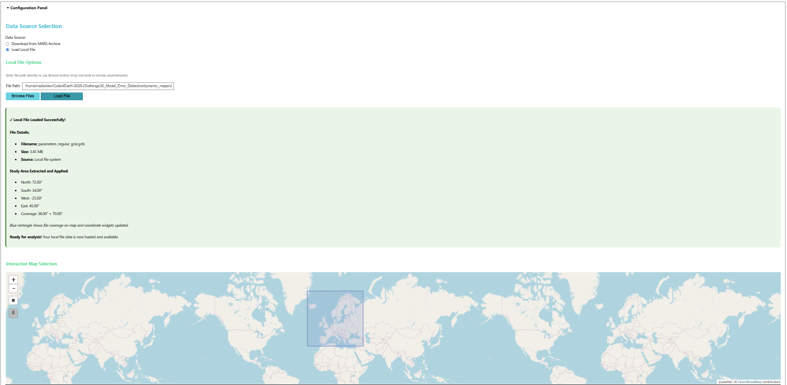

### Step 2: Calculate Derived Variables (Optional)

1. Expand the **"Surface Variables Calculator"** panel.
2. Choose a calculation type from the dropdown (Wind Speed, Accumulated Precipitation, Extremes). The interface tells you whether the calculation is possible given the data you've loaded.
3. Click **"Calculate"** — the computed variable is added to your available parameters.

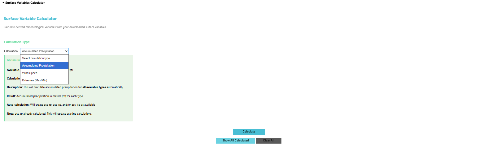

**Available calculation methods:**

| Calculation | Input(s) | Output |
|---|---|---|
| **Wind Speed** | 10m U (`u10`) and V (`v10`) components | Instantaneous wind speed magnitude at each timestep |
| **Accumulated Precipitation** | Total Precipitation (`tp`) | Total precipitation accumulated between the first and last forecast step |
| **Max/Min Values** | Any time-varying variable (temperature, wind gust, etc.) | Maximum or minimum value at each grid point across all timesteps |

### Step 3: Create Visualizations

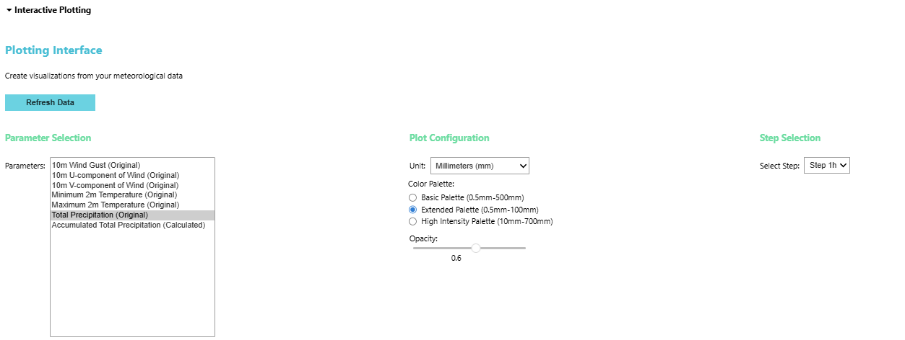

1. Click **"Refresh Data"** to make sure the latest data is loaded.
2. **Parameter Selection**: choose from both original and calculated variables.
3. **Plot Configuration**: choose a display **Unit** (e.g. Millimeters) and **Color Palette** (Basic / Extended / High Intensity).
4. **Step Selection**: pick which forecast time step to visualize.
5. **Plot Type Selection**: choose a visualization type and click **"Generate Plot"**. Progress is shown in the info box below.

**Available visualization options:**

- **Dynamic Map** — interactive visualization for a specific time step.

  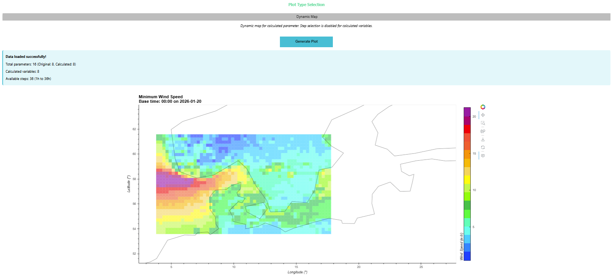

- **Static Map** — a fixed map for a specific time step, generated via `earthkit` (recommended for presentations/reports).

  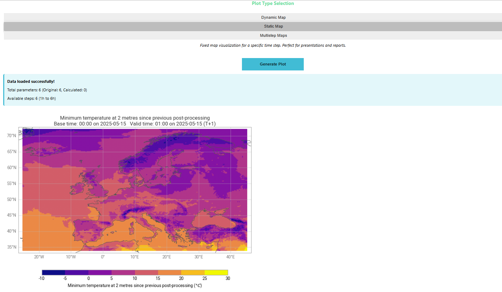

- **Multi-Step Maps** — interactive, animated visualization of temporal evolution across several forecast steps.

  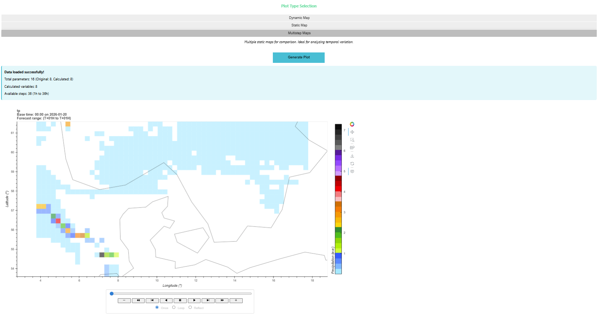

**Availability by variable type:**

| Variable Type | Static Map | Dynamic Map | Multi-Step Map |
|---|---|---|---|
| Retrieved | ✅ | ✅ | ✅ |
| Calculated (Wind Speed) | ❌ | ✅ | ✅ |
| Calculated (other) | ❌ | ✅ | ❌ |

*Wind speed is the only calculated variable that supports multi-step maps.*

---

## ⏱️ Clickable Timeseries

**EvalKit — Interactive Weather Model Timeseries Analysis**

### Overview

The interface consists of a **Configuration Panel** (Data Source, Parameter & Analysis, and Observation Data sections) and a **Visualization Panel** (an interactive time-series chart alongside a geographic map with forecast points, observation stations, and drawing controls).

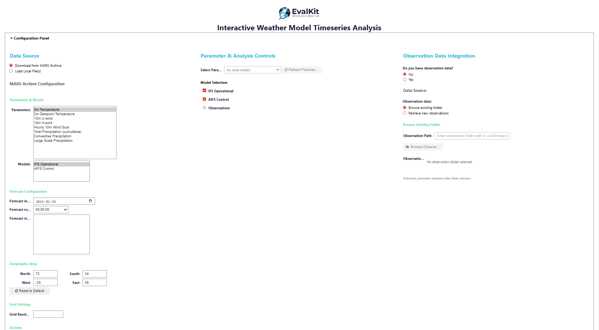

### Step 1: Get Forecast Data

**Option A: Download from MARS Archive**
1. Select **"Download from MARS Archive"**.
2. Choose your model from the dropdown.
3. Set the time period using the date pickers and time selection.
4. Define the geographic area by drawing a bounding box on the map or entering coordinates manually.
5. Set grid resolution if needed.
6. Click **"Preview"** to review, then **"Retrieve Data"**.

**Option B: Load Local Files**
1. Select **"Load Local File(s)"**.
2. Click **"Browse AIFS"** and/or **"Browse IFS"** to select model files, or paste in the paths of your GRIB files directly.
3. Click **"Load File"** to process the selected files, and verify success in the Loading Summary panel.

### Step 2: Select Analysis Parameter

1. Choose the meteorological parameter to analyze from the dropdown menu.
2. Check the boxes for the models you want to compare (AIFS, IFS).

### Step 3: Add Observation Data (Optional)

**If you already have observation data:**
1. Select **"Yes"** for "Do you have observation data?".
2. Select **"Browse existing folder"** or paste in its path.
3. Click **"Browse Observations"** to select the folder — the system automatically validates parameter compatibility.

**If you need to retrieve observation data:**
1. Select **"Yes"**, then **"Retrieve new observations"**.
2. Configure the VINO path to your `vino_getgeo` executable.
3. Choose data sources (SYNOP, HDOBS, or both).
4. Set the observation period and time range.
5. Choose an output folder and click **"Retrieve Observations"**.

Once loaded, check the **"Observations"** box to include it in your analysis.

### Step 4: Select Analysis Points

1. Click within your defined geographic area on the map, or add coordinates manually.
2. Selected points appear as colored markers; select multiple points to compare locations.
3. Orange markers represent observation stations (if loaded) — click to select them.

### Step 5: Analyze Results

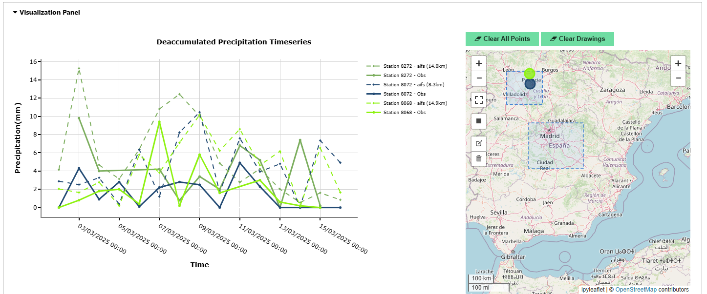

1. View the time-series chart for all selected points.
2. Each point/station has a unique color matching its map marker.
3. Use the chart toolbar for zooming and detailed inspection.
4. Compare forecast models against observations directly.

### Step 6: Manage Your Analysis

- **Clear All Points** — remove all selected forecast points and observation stations.
- **Clear Drawings** — remove bounding boxes from the map.
- **Modify Selection** — click existing points to remove them, or add new ones.

### Typical Workflow

1. **Get Data** — download from MARS or load local files.
2. **Choose Parameter** — select what to analyze.
3. **Add Observations** — load observation data if available.
4. **Select Points** — click on the map to choose analysis locations.
5. **Compare** — view time-series plots of forecasts vs. observations.

---

## 📊 Probabilistic Forecast Tool

**EvalKit — Probabilistic Forecast Analysis Tool**

### Overview

Provides ensemble forecast visualization and uncertainty quantification through four analysis types:

1. **Meteogram** — time series for a single location across the forecast range.
2. **Plumes** — ensemble spread visualization for uncertainty analysis.
3. **Stamps** — spatial ensemble-spread plots for a specific forecast date and step.
4. **CDF** — cumulative distribution functions from climate data.

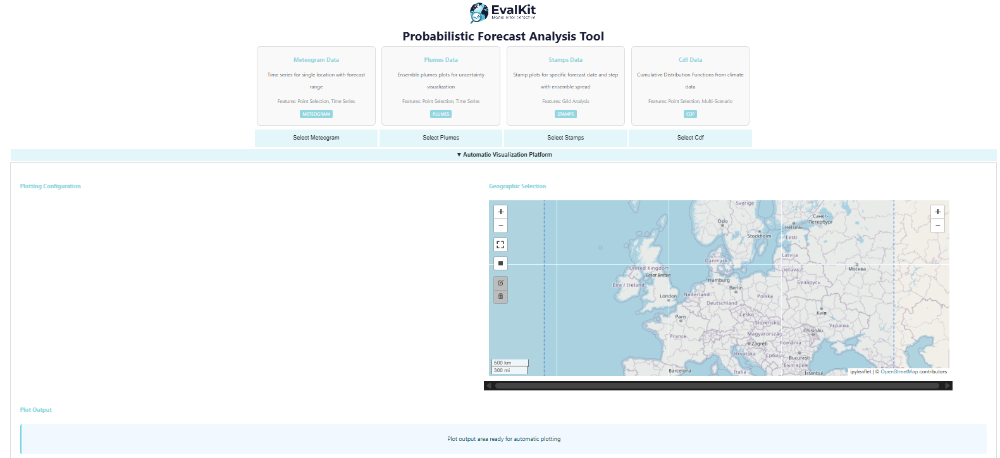

### Step 1: Select Plot Type

Choose your desired analysis type from the four options at the top of the interface.

### Step 2: Configure Your Data Source

The interface adapts based on the selected plot type.

#### Option A: Download from MARS Archive

**For Meteogram and Plumes:**

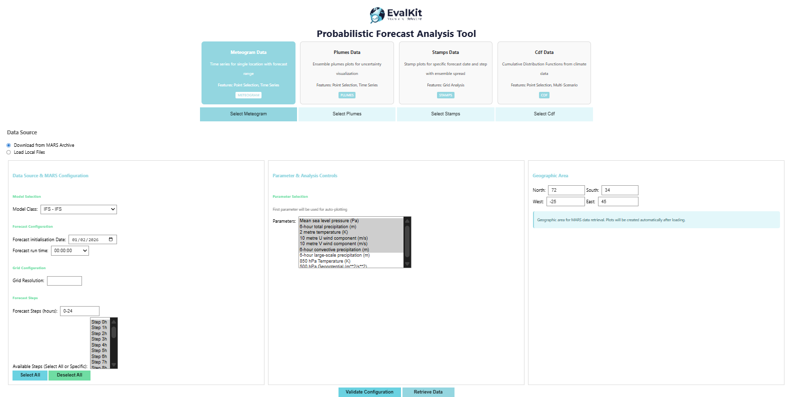

1. **Model Class**, **Forecast Initialization Date**, and **Forecast run time**.
2. **Grid Resolution** (leave empty for reduced Gaussian grid).
3. **Forecast Steps** (e.g. `0-24`), reviewed in the scrollable "Available Steps" list, with **Select All**/**Deselect All** helpers.
4. **Parameter Selection** from the scrollable list.
5. **Geographic Area** (North/South/West/East), settable via the interactive map or manual entry.
6. **Validate Configuration**, then **Retrieve Data**.

This retrieves both **perturbed forecasts** and the **control forecast** for each selected parameter.

> 📝 Configuration and loaded data are preserved when switching between Meteogram and Plumes, since both use the same input data structure.

**For Stamps:** the same configuration sections apply (Model Class, date/time, grid, steps, parameters, area). Retrieves **control forecast**, **perturbed forecasts** (ensemble members), and the **deterministic forecast**.

**For CDF:**

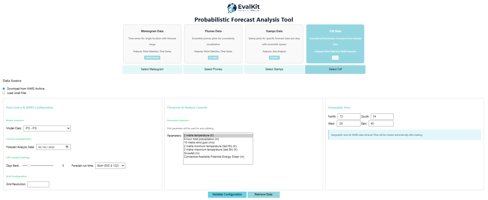

1. **Model Class** and **Forecast Analysis Date**.
2. **Days Back** (slider) — how many days back from the analysis date to look.
3. **Forecast run time** — which initialization times to include (e.g. Both 00Z & 12Z).
4. **Grid Resolution** and **Parameter Selection**.
5. **Geographic Area**, then **Validate Configuration** / **Retrieve Data**.

This retrieves climate data and perturbed forecasts for each day/run time within the lookback period, enabling CDF analysis.

#### Option B: Load Local Files

For all plot types, you can load previously downloaded files instead of retrieving from MARS.

- **Meteogram/Plumes**: requires an **Ensemble Forecast File** and a **Control Forecast File**.

  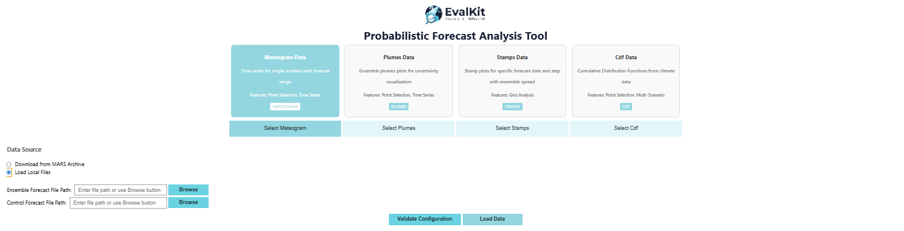

- **Stamps**: requires a **Deterministic**, **Control**, and **Ensemble** forecast file.

  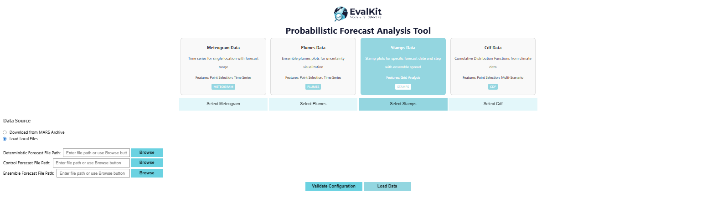

- **CDF**: requires a **Climate Data File** plus one file per scenario (e.g. `D-0_00Z`, `D-0_12Z`, `D-1_00Z`, ...), where `D-N` means N days back from the analysis day. Use **"Add More Scenario Files"** / **"Delete"** to manage rows.

  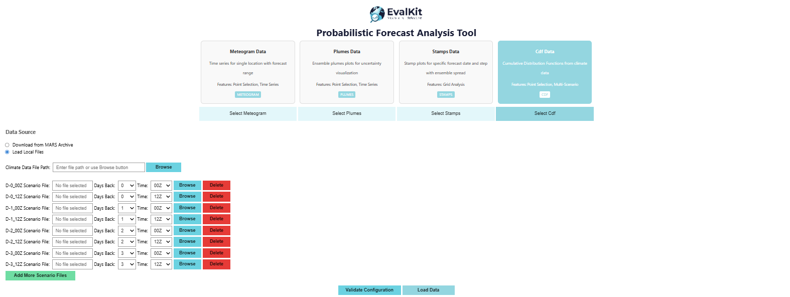

In every case: **Validate Configuration** to verify your files, then **Load Data**.

### Step 3: Observation Data Integration (Optional, Meteogram & Plumes only)

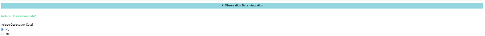

Select **"Yes"** to enable model-observation comparison, then choose:

**Option A: Browse Existing Folder** — select a local folder that already contains observation files.

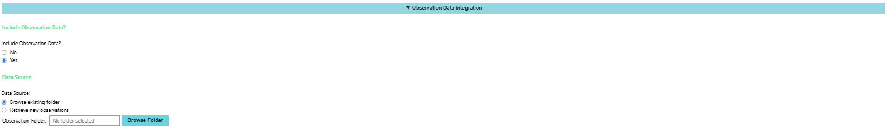

**Option B: Retrieve New Observations** — download fresh observation data using VINO:

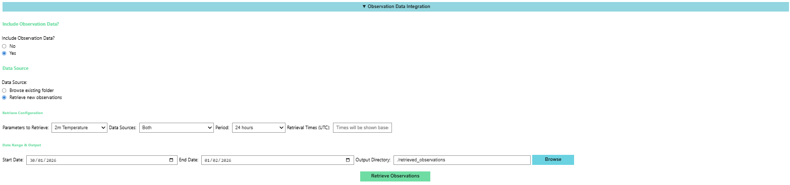

1. **Parameter to Retrieve**, **Data Sources** (SYNOP, HDOBS, or both), and **Period** (for period-based parameters like precipitation, wind gust, or temperature extremes).
2. **Retrieval Times (UTC)** are computed automatically from the parameter/period (e.g. instantaneous parameters are retrieved every 3 hours: 0, 3, 6, 9, 12, 15, 18, 21 UTC).
3. **Start Date**/**End Date** (`DD/MM/YYYY`) and an **Output Directory**.
4. Click **"Retrieve Observations"**.

### Step 4: Automatic Visualization Platform

**For Meteogram and Plumes:**

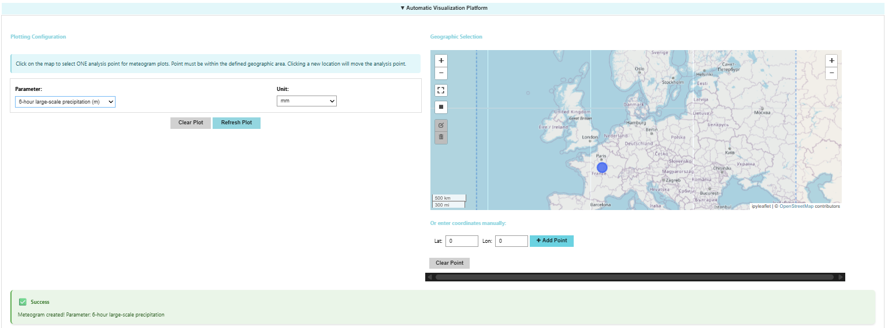

1. Choose a **Parameter** and preferred **Unit** from the dropdowns.
2. Click on the map to select **one** analysis point (or enter Lat/Lon manually and click **"+ Add Point"**).
3. The plot is generated automatically once a point is selected.

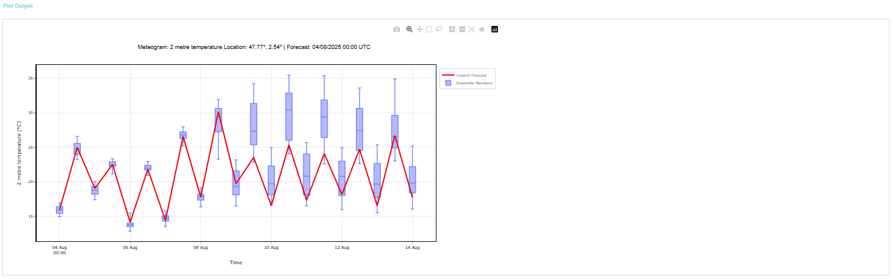

- **Meteogram**: red line = control forecast; blue boxes = ensemble member spread.
- **Plumes**: orange line = control forecast; shaded green bands = ensemble spread (0–100%, 5–95%, 25–75% IQR), with the darkest line showing the median.

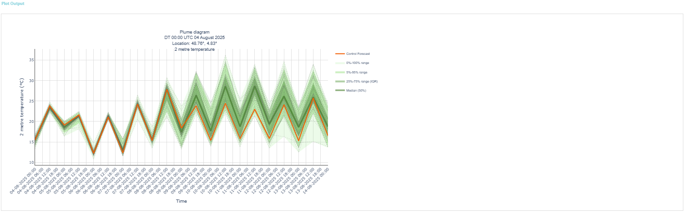

> 📝 Switching between Meteogram and Plumes preserves your configuration and data for the same location/parameter.

**For Stamps:**

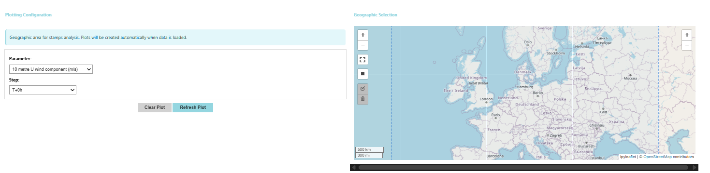

Select a **Parameter** and **Forecast Step**; the plot shows a grid of individual ensemble members (MEM 01, MEM 02, ...) plus the control member.

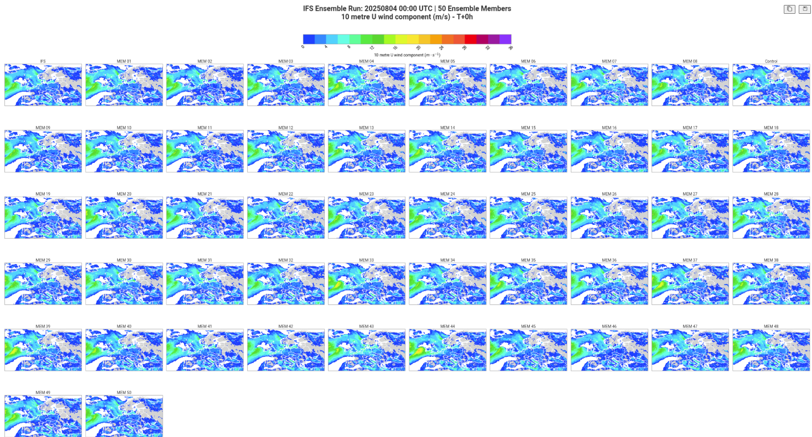

Key information displayed: ensemble run date/time, number of members, parameter name/units, and forecast step (T+hours).

**For CDF:**

Select a **Parameter**, then click on the map (or enter Lat/Lon) to select one analysis point. The cumulative distribution function plot shows the statistical distribution of the parameter across all scenarios.

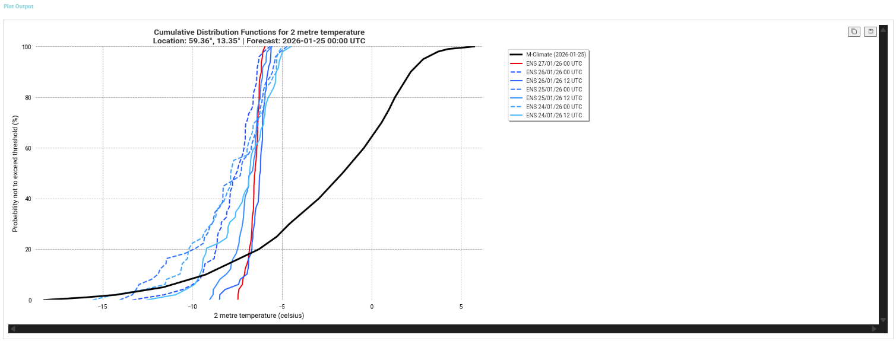

> 💡 CDF plots are particularly useful for understanding the probability distribution of extreme events, or for comparing forecast reliability across different initialization times.

---

## Customization and Extensibility

All three tools are designed to be **scalable and customizable** — you can extend them to support additional weather models and parameters by editing their configuration files. Each tool has its own copy of these files:

| Tool | Config file | Styling file |
|---|---|---|
| Dynamic Maps | `dynamic_maps/helpers/config.json` | `dynamic_maps/helpers/styling_config.py` |
| Clickable Timeseries | `clickable_timeseries/helpers/config.json` | `clickable_timeseries/helpers/plotting/styling_config.py` |
| Probabilistic Forecast Tool | `probabilistic_forecast_tool/helpers/model_config.json` | `probabilistic_forecast_tool/helpers/styling_config.py` |

### Adding a New Model

Add an entry to the tool's `config.json` (or `model_config.json`) describing the model's MARS `class`, `stream`, `type`, `levtype`, step pattern, and whether it supports custom step expansion:

```json
"new-model": {
  "display_name": "New Model Name",
  "class": "od",
  "stream": "oper",
  "type": "fc",
  "levtype": "sfc",
  "step_pattern": "six_hourly",
  "supports_custom_step_expansion": false,
  "description": "Description of the new model",
  "ui_order": 3
}
```

### Adding a New Parameter

Add an entry describing the parameter's MARS `param_id`, display name, units, and which models it's available for:

```json
"new_param": {
  "param_id": 999,
  "name": "New Parameter Name",
  "display_name": "Display Name",
  "units": "unit",
  "description": "Parameter description",
  "available_models": ["model-name"],
  "category": "category_name",
  "ui_order": 10
}
```

> ⚠️ **Step compatibility**: parameters with different temporal resolutions (e.g. 6-hourly vs. 1-hourly) should not be mixed in the same analysis. For example, the 10m Wind Gust parameter (`10fg6`) typically has 6-hour intervals, while parameters like 2m Temperature may have 1-hour intervals — mixing incompatible step configurations can cause data alignment issues.

### Customizing Visualization Styling

Edit the tool's `styling_config.py` to control color palettes, contour level definitions, unit conversions, and parameter categorization:

1. Add your parameter to the appropriate category in the `parameter_types` (or equivalent) dictionary.
2. Define a color palette and levels if introducing a new parameter type.
3. Add title formatting in the relevant `_get_*_title()` method.
4. Add unit conversion logic in `transform_data_and_levels()` if needed.

```python
self.parameter_types = {
    # Existing categories...
    "new_category": ["new_param1", "new_param2"],
}

# Define colors and levels for the new category
self.new_category_colors = [
    "rgb(0,0,255)",
    "rgb(0,255,0)",
    # ... more colors
]
self.new_category_levels = [0, 10, 20, 30, 40, 50]
```

---

## Tips for Best Results

- Start with smaller geographic areas and shorter time periods for initial exploration.
- Always preview/validate your configuration before retrieving large datasets from MARS.
- Draw bounding boxes directly on the map for precise geographic area selection.
- When using observations, make sure the time period matches your forecast data — the tools will warn you if observation and forecast parameters don't match.
- In the Probabilistic Forecast Tool, switching between Meteogram and Plumes (or reusing a Stamps/CDF configuration) preserves your data and configuration, since they share the same underlying inputs.

## Getting Help / Contributing

- For environment setup issues, see [GETTING_STARTED.md](GETTING_STARTED.md).
- To report issues or contribute changes, see [CONTRIBUTING.md](CONTRIBUTING.md) for the development workflow, linting, and pull request guidelines.
